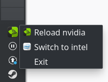

optimus-manager
==================

This Linux program provides a solution for GPU switching on Optimus laptops (i.e laptops with a dual Nvidia/Intel or Nvidia/AMD configuration).

Obviously this is unofficial, I am not affiliated with Nvidia in any way.

**Only Archlinux and Archlinux-based distributions (such as Manjaro) are supported for now.**
Only Xorg sessions are supported (no Wayland).

Supported display managers are : SDDM, LightDM, GDM.

optimus-manager can also work with other display managers (or with no display manager at all) but you have to configure them manually (see [FAQ section 1](https://github.com/Askannz/optimus-manager/wiki/FAQ,-common-issues,-troubleshooting#my-display-manager-is-not-sddm-lightdm-nor-sddm) [FAQ section 2](https://github.com/Askannz/optimus-manager/wiki/FAQ,-common-issues,-troubleshooting#i-do-not-use-a-display-manager-i-use-startx-or-xinit) ).

Introduction
----------
GPU offloading and power management with Nvidia cards are not properly supported on Linux ([though there has been some great progress recently](https://devtalk.nvidia.com/default/topic/1060977/announcements-and-news/-linux-solaris-and-freebsd-driver-435-17-beta-release-/)), which can make it hard to use your Optimus laptop at full performance. optimus-manager provides a workaround to this problem by allowing you to run your whole desktop session on the Nvidia GPU, while the Intel/AMD GPU only acts as a "relay" between the Nvidia GPU and your screen.

This is essentially a port to Archlinux of the **nvidia-prime** solution created by Canonical for Ubuntu.

To learn more about the current Optimus situation on Linux and how this solution works, read the [Home Wiki page](https://github.com/Askannz/optimus-manager/wiki).

IMPORTANT : Gnome and GDM users
----------

If you use Gnome or the Gnome Display Manager (GDM), there are a couple extra requirements to be able to use optimus-manager :

* The default `gdm` package from the Archlinux and Manjaro repositories is not compatible with optimus-manager, so you must replace it with this patched version : [gdm-prime](https://aur.archlinux.org/packages/gdm-prime/) (also replaces `libgdm`). The patch was written by Canonical for Ubuntu and simply adds two script entry points specifically for Prime switching. The package is otherwise identical to the official one.

* Gnome launches Wayland sessions by default, which are incompatible with optimus-manager. To force Xorg sessions, You need to edit the file `/etc/gdm/custom.conf` and remove the `#` before the line `#WaylandEnable=false`.

Another quirk of GDM is that the X server may not automatically restart after a GPU switch. If you see an empty black screen or a black screen with a blinking cursor, try switching back to an empty TTY (with Ctrl+Alt+F5 for instance), then back to TTY1 with Ctrl+Alt+F1. See [this FAQ question](https://github.com/Askannz/optimus-manager/wiki/FAQ,-common-issues,-troubleshooting#after-trying-to-switch-gpus-i-am-stuck-with-a-black-screen-or-a-black-screen-with-a-blinking-cursor-or-a-tty-login-screen).

IMPORTANT : Manjaro KDE users
----------

Manjaro ships with a default configuration for SDDM (the default login manager for KDE) which overrides some keys needed by optimus-manager. To use optimus-manager, you need to edit the file `/etc/sddm.conf` and simply put a `#` before the line starting with `DisplayCommand`and the one starting with `DisplayStopCommand`.

Installation
----------

Naturally, you must have the proprietary nvidia driver installed on your system. On Archlinux, you can use the packages `nvidia` or `nvidia-dkms`, or a specific nvidia-package if you run a custom kernel (e.g. `nvidia-lts` with `linux-lts` etc.). On Manjaro, it is fine to use the built-in driver utility.

You can install optimus-manager from this AUR package : [optimus-manager](https://aur.archlinux.org/packages/optimus-manager/)

**Note :** Do not install this program by cloning this repository and running `setup.py`, or by using `pip` directly. Doing so will only install the Python package but leave out important files that optimus-manager needs. 

After installation, the optimus-manager daemon should have been started automatically, but you can check its status with `systemctl status optimus-manager.service`.

**Important notes :**

* **Custom Xorg config :** optimus-manager works by auto-generating a Xorg configuration file and putting it into `/etc/X11/xorg.conf.d/`. If you already have custom Xorg configuration files at that location or at `/etc/X11/xorg.conf `, it is strongly advised that you remove anything GPU-related from them to make sure that they do not interfere with the GPU switching process.

* **Nvidia-generated Xorg config :** Similarly, if you have ever used the `nvidia-xonfig` utility or the `Save to X Configuration File` button in the Nvidia control panel, a Xorg config file may have been generated at `/etc/X11/xorg.conf `. It is highly recommended to delete it before trying to switch GPUs.

* **Manjaro-generated Xorg config :** Manjaro has its own driver utility called MHWD that also auto-generates a Xorg config file at `/etc/X11/xorg.conf.d/90-mhwd.conf`. optimus-manager will automatically delete that file to avoid issues.

* **Manjaro Gnome** : see the previous section **Gnome and GDM users**

* **Manjaro KDE** : see the previous section **Manjaro KDE users**

* **Bumblebee :** optimus-manager is incompatible with Bumblebee since both tools would be trying to control GPU power switching at the same time. If Bumblebee is installed, you must disable its daemon (`sudo systemctl disable bumblebeed.service`, then reboot). This is particularly important for Manjaro users since Bumblebee is installed by default.

* **nvidia-xrun :** if you have previously installed nvidia-xrun by following [instructions](https://wiki.archlinux.org/index.php/Nvidia-xrun#Configuration) on the Arch Wiki, make sure all its configuration files are removed. See issue (https://github.com/Askannz/optimus-manager/issues/135).

* **GPU monitoring apps** : if you have an application (or tray widget) that automatically monitors the Nvidia GPU for things like load, temperature, VRAM usage, etc, make sure it is not running before switching to integrated mode. Those applications work by constantly polling the nvidia driver, which may prevent it from being unloaded by optimus-manager.

Uninstallation
----------

To uninstall the program, simply remove the `optimus-manager` package. The auto-generated Xorg config file will be automatically cleaned up.

You can also force cleanup by running `optimus-manager --cleanup`.

You can also disable optimus-manager by disabling the systemd service `optimus-manager.service` (needs a reboot to be applied).

Usage
----------

Run
* `optimus-manager --switch nvidia` to switch to the Nvidia GPU
* `optimus-manager --switch integrated` to switch to the integrated GPU and power the Nvidia GPU off
* `optimus-manager --switch hybrid` to switch to the iGPU but leave the Nvidia GPU available for on-demand offloading, similar to how Optimus works on Windows. See [the Wiki](https://github.com/Askannz/optimus-manager/wiki/Nvidia-GPU-offloading-for-%22hybrid%22-mode) for more details.

*WARNING :* Switching mode automatically logs you out, so make sure you save your work and close all your applications before doing so.

Auto-logout is supported for the following desktop environments/window managers: KDE Plasma, Gnome, XFCE, Deepin, i3, Openbox, AwesomeWM, bspwm, dwm, LXDE, QTile. You can disable this feature in the configuration file. In that case, the GPU switch will not be effective until the next login.

You can also specify which GPU you want to be used by default when the system boots, by setting `startup_mode` in the [configuration file][optimus-manager.conf](optimus-manager.conf) at `/etc/optimus-manager/optimus-manager.conf`.

Note that switching to and from "integrated" mode can be a little unstable, due to having to load/unload the nvidia kernel modules and change the power state of the card. If you're experiencing stability issues, the safest way to use this mode is to boot straight into it using the `startup_mode` config options or the kernel parameter (see below).

#### System Tray App

The program [optimus-manager-qt](https://github.com/Shatur95/optimus-manager-qt) provides a system tray icon for easy switching. It also includes a GUI for setting options without editing the configuration file manually.    
AUR package : [optimus-manager-qt](https://aur.archlinux.org/packages/optimus-manager-qt/)

Unofficial Gnome Shell extensions are also avaialble :

* [optimus-manager-argos (unmaintained)](https://github.com/inzar98/optimus-manager-argos).

* [optimus-manager-indicator](https://extensions.gnome.org/extension/2908/optimus-manager-indicator/)

#### Kernel parameter

As an alternative to `startup_mode`, optimus-manager also allows you to set the startup GPU mode using a kernel parameter. This is useful if you want to create multiple entries in your bootloader with different GPU startup modes (for instance a "battery-saving" mode that starts with the integrated GPU, and a "gaming" mode that starts with Nvidia).

Simply add `optimus-manager.startup=MODE` to your kernel parameters list, where `MODE` can be any startup mode. Note that this parameter overrides whatever startup mode was set in the config file.

Also note that this parameter only affects which GPU your desktop session starts with ; it has absolutely no effect on the boot process before that, because optimus-manager has no control over it.

Power management
----------

Since version v1.2, power management is disabled by default, so the Nvidia GPU will stay powered on (consuming energy) until manual configuration is done. This choice was made because there is no catch-all configuration that works for all laptop models, and incorrect configurations often break the boot process.

Please refer to [the guide on power management](https://github.com/Askannz/optimus-manager/wiki/A-guide--to-power-management-options) in the Wiki.

Configuration
----------

#### Main configuration file

The default configuration file can be found at `/usr/share/optimus-manager.conf`. Please do not edit this file ; instead, edit the config file at `/etc/optimus-manager/optimus-manager.conf` (or create it if it does not exist).

Any parameter not specified in your config file will take value from the default file. Remember to include the section headers of the options you override.

Please refer to the comments in the [default config file](https://github.com/Askannz/optimus-manager/blob/master/optimus-manager.conf) for descriptions of the available parameters. In particular, it is possible to set common Xorg options like DRI version or triple buffering, as well as some kernel module loading options.

No config changes will be effective until you computer is rebooted or the optimus-manager service is restarted.

#### Extra Xorg configuration

You can also add your own options to the auto-generated Xorg config by editing the files at `/etc/optimus-manager/xorg/`.
Anything you write in those files will be copied to one of the "Device" sections of the auto-generated Xorg configuration at `/etc/X11/xorg.conf.d/10-optimus-manager.conf`.
There are specific files for specific modes and GPUs; for instance, `/etc/optimus-manager/xorg/hybrid-mode/integrated-gpu.conf` only applies to the Xorg config of the integrated GPU in "hybrid" mode.

#### Display setup scripts

If you need the display manager to run some specific commands to set up the display (to force a particular resolution, for instance), you can write them to `/etc/optimus-manager/xsetup-integrated.sh`, `/etc/optimus-manager/xsetup-nvidia.sh` and `/etc/optimus-manager/xsetup-hybrid.sh`.

#### Custom enable/disable scripts for Nvidia

Finally, if you need to run some specific commands prior to enabling or after disabling the nvidia graphics card (for example, to manually enable the card if the available power management methods are not supported), you can write them to `/etc/optimus-manager/nvidia-enable.sh` and `/etc/optimus-manager/nvidia-disable.sh`.

FAQ / Troubleshooting
----------

See the [FAQ section](https://github.com/Askannz/optimus-manager/wiki/FAQ,-common-issues,-troubleshooting) in the Wiki.

Credit
----------
The Qt tray app was created by [Shatur95](https://github.com/Shatur95).
